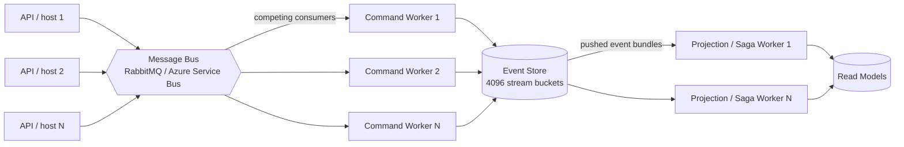

<div align="center">


# Stratara

**CQRS and Event Sourcing for .NET — with tamper-evident streams and tenant-aware encryption built in.**

[](https://github.com/yesbert/Stratara/actions/workflows/ci.yml) [](https://www.nuget.org/packages?q=Stratara) [](LICENSE) [](https://docs.stratara.tech) [](https://dotnet.microsoft.com/) [](https://docs.stratara.tech/concepts/tenant-aware-encryption.html)

</div>

---

Stratara is the integrated CQRS, Event Sourcing, and audit stack you'd otherwise compose yourself from three or four libraries. Mediator, outbox, event store, sagas, projections, and identity — all wired together, lockstep-versioned across 25 NuGet packages for .NET 10. Opt in à la carte.

> **License:** Stratara ships under the **MIT License** ([LICENSE](LICENSE)) — OSI-approved open source, free for any use including commercial.

## Why Stratara

🔒 **Tamper-Evident by Design** — Every event stream is hash-chained by a background worker, and periodic anchors pin the chain head to a source of truth outside your infrastructure. Edit a row directly in Postgres and the chain no longer recomputes: a verification pass — your audit job, or the anchor check — names the exact sequence where it broke. The framework preserves the evidence and leaves the schedule to you; it does not scan for tampering on its own. Audit-grade evidence, not a "trust the DBA" promise. ([Concept](https://docs.stratara.tech/concepts/tamper-evident-streams.html) · [Hero Sample](samples/Stratara.Sample.TamperProof))

🛡️ **Tenant-Aware Encryption** — `[EncryptData]` fields are sealed with AES-GCM and an authentication tag bound to the tenant id as Associated Data. A row leaked from one tenant cannot be decrypted in another tenant's session — *even with the correct master key*. The tenant binding is cryptographic, not a `WHERE tenant_id = …` you hope nobody forgets. ([Concept](https://docs.stratara.tech/concepts/tenant-aware-encryption.html) · [Hero Sample](samples/Stratara.Sample.Encryption))

⚖️ **GDPR Article 17 by Construction** — Append-only event sourcing and the right to erasure are natural enemies: you cannot delete an immutable event. Stratara's answer is **crypto-shredding** — each subject's data is encrypted under a destroyable per-scope key, and a single `EraseScopeAsync` call shreds that key so every copy — events, snapshots, replicas, *and backup tapes you can't even reach* — becomes undecryptable noise. Erasure without rewriting history, provable on a 30-day regulatory clock. The same per-subject-key model underwrites SOC 2 / ISO 27001 key-lifecycle controls and HIPAA per-patient separation. ([Concept](https://docs.stratara.tech/concepts/tenant-aware-encryption.html))

🚦 **Tenant Isolation at the Door** — Beyond field-level encryption: a request that names a tenant other than the caller's is rejected at the *mediator entrance*, before your handler runs — opt-in via the `ITenantScopedRequest` marker. A strict mode routes every privileged cross-tenant operation (a platform admin acting on another tenant's data) through one auditable `ICrossTenantAuthorizer` that denies by default. The command-/query-side complement to the database tenant filters, so isolation isn't a `WHERE tenant_id = …` each handler has to remember. ([Guide](https://docs.stratara.tech/guides/enforce-tenant-isolation.html))

🧩 **Integrated, not Assembled** — Mediator + Outbox + Event Store + Sagas + Projections + Identity, lockstep-versioned across 25 packages. One `<VersionPrefix>` bump moves everything together. No multi-library composition tax, no version-skew puzzles, no integration tests to prove your bus and your event store still see eye-to-eye.

⚡ **Fast by Default, Scales Horizontally** — Reflection-free hot paths: commands, event replay, and projection dispatch run through compiled expressions, not `MethodInfo.Invoke`. Projections are push-driven — subscribed to the event bus, never polling a table. And every stream maps to one of 4096 deterministic buckets, so command, projection, and saga workers scale out as competing consumers across N nodes on RabbitMQ or Azure Service Bus. The measured numbers — replay throughput, reflection-free property access, constant-memory rebuilds — are in [Performance & horizontal scale](#performance--horizontal-scale) just below.

## Performance & horizontal scale

Numbers, not adjectives — measured with [BenchmarkDotNet](https://github.com/dotnet/BenchmarkDotNet) on a **fanless MacBook Air M4** (Apple M4, .NET 10, Arm64 RyuJIT). Passively-cooled *laptop* hardware, so read these as conservative ratios, not a tuned server's ceiling. Re-run them yourself: `dotnet run -c Release --project tests/Stratara.Benchmarks -- --filter '*'`.

**Replay stays cheap — and flat on memory.** In-memory aggregate replay through the compiled-expression apply-dispatch (excludes the database read a real rehydration adds):

| Events replayed | Time | Allocated |
|---|---:|---:|
| 10,000 | 0.11 ms | 64 B |
| 100,000 | 1.13 ms | 64 B |
| 1,000,000 | 11.6 ms | **64 B** |

~11 ns per event — and the allocation stays **constant at 64 bytes** no matter how long the stream is. A million-event aggregate rebuilds without producing garbage.

**Reflection-free hot paths.** Commands, event-apply, projections, and sagas dispatch through compiled `Expression` delegates, never `MethodInfo.Invoke`. The same machinery drives property access:

| Property access | Reflection | Compiled delegate | Speedup |
|---|---:|---:|---:|
| Write | 6.04 ns | 0.47 ns | **~13× faster** |
| Read | 3.86 ns | 0.62 ns | **~6× faster** |

Both allocation-free. Source-generated logging adds **~0.5 ns / 0 B** when its level is off (classic interpolated logging allocates regardless); tamper-evident chain hashing runs **sub-microsecond per event** (hardware-accelerated SHA-256). Full methodology and the honest caveats live in [Performance & Scaling](https://docs.stratara.tech/concepts/performance-and-scaling.html).

**Scales horizontally.** Commands flow through a message bus to *competing-consumer* workers — you add nodes, not bigger machines. Stream ids partition deterministically across 4096 buckets (single-writer per aggregate, full parallelism across aggregates), and projections are pushed from the event bus, never polled.



## Why we share this

Stratara is the integrated CQRS / Event Sourcing / audit stack we built for our own products — the wiring that production event-sourced apps tend to write from scratch, plus the tamper-evident and tenant-aware-encryption properties we wanted as a *default*, not as an enterprise-tier add-on.

We're publishing it because the .NET ecosystem deserves these primitives without the composition tax of stitching together Marten + Wolverine + MassTransit + your own crypto layer. Compliance-relevant integrity (GDPR Article 17 via crypto-shredding, SOC 2 audit-trail, HIPAA data integrity) should not be locked behind a license tier — it should be how the storage layer works by default.

That's why Stratara ships under the **MIT License** — true open source, free for any use including commercial, with no competition clause and no time-delay. Take what you need, fork it, build on it.

## Documentation

Full docs, conceptual overview, getting-started walkthrough, guides, samples and the auto-generated API reference live at **[docs.stratara.tech](https://docs.stratara.tech)**.

**Using an AI assistant?** Stratara ships an [`llms.txt`](llms.txt) at the repo root — a machine-readable index of the core interfaces, routing conventions, tier rules, and package map, following the [llms.txt convention](https://llmstxt.org). Point your assistant at it, or connect any MCP-capable client to `gitmcp.io/yesbert/Stratara` (which reads `llms.txt` first) so it grounds on current Stratara APIs instead of stale training data.

## Install

```bash
# Minimum: in-process mediator + pipeline behaviors
dotnet add package Stratara.Mediator

# Event-sourced apps with the full stack
dotnet add package Stratara.EventSourcing.EntityFrameworkCore
dotnet add package Stratara.EventSourcing.WorkerDefaults
dotnet add package Stratara.Outbox.RabbitMQ
```

Hello-mediator in five lines:

```csharp
var builder = WebApplication.CreateBuilder(args);

builder.Services.AddMediator();
builder.Services.AddCommandHandlersFromAssemblyContaining<Program>();

var app = builder.Build();

// IMediator is scoped — resolve it from a scope, not from app.Services.
using var scope = app.Services.CreateScope();
var mediator = scope.ServiceProvider.GetRequiredService<IMediator>();
await mediator.HandleAsync(new MyCommand(), CancellationToken.None);
```

## Package map

Lockstep-versioned NuGet family — every package in the table below ships at the same `<VersionPrefix>`, bumped together (Microsoft.Extensions.* convention).

| Tier | Package | Purpose |
|---|---|---|
| A | `Stratara.Abstractions` | Contract interfaces + POCO records (no implementation) |
| A | `Stratara.Contracts` | Wire-level POCO contracts |
| A | `Stratara.Diagnostics` | `ActivitySource` / `Meter` / log-event-ID schema |
| A | `Stratara.Resilience` | Polly named pipelines |
| B | `Stratara.Sessions` | Actor / Subject session model + ASP.NET middleware |
| B | `Stratara.Mediator` | In-process mediator + pipeline behaviors |
| B | `Stratara.Domain` | Tenant aggregate + lifecycle events |
| B | `Stratara.Shared` | Umbrella re-export of A/B abstractions + source-generated logger extensions |
| B | `Stratara.ServiceDefaults` | OpenTelemetry + Serilog defaults |
| C | `Stratara.EventSourcing.EntityFrameworkCore` | Write / read / identity stores on PostgreSQL |
| C | `Stratara.EventSourcing.Pipeline.CommandAudit` | Command-audit pipeline behavior |
| C | `Stratara.Validation` | Vendor-neutral `IValidator<T>` + validation pipeline behavior |
| C | `Stratara.EventSourcing.WorkerDefaults` | Worker-host wiring composites |
| C | `Stratara.Projections` | Projection runtime |
| C | `Stratara.Sagas` | Saga runtime |
| C | `Stratara.Security` | Key store (KEK-wrapped versioned DEKs) + AES-GCM envelope encryption |
| C | `Stratara.Outbox.RabbitMQ` | Outbox + RabbitMQ-backed `IMessageBus` |
| C | `Stratara.Outbox.AzureServiceBus` | Outbox + Azure Service Bus-backed `IMessageBus` |
| C | `Stratara.Infrastructure` | Cross-cutting infrastructure glue |
| C | `Stratara.Identity.Core` | Channel-agnostic identity primitives |
| C | `Stratara.Identity.AspNetCore` | Channel-agnostic ASP.NET Core identity wiring (sign-in manager wrapper + membership tenant-claim bridge + i18n + email-sender stub) |
| C | `Stratara.Identity.EntityFrameworkCore` | Identity directory: user↔tenant membership, membership-backed authorization (roles + permissions), scoped settings store |
| C | `Stratara.ServiceDefaults.AspNetCore` | ASP.NET health checks + request OpenTelemetry |
| — | `Stratara.Testing` | Test doubles (in-memory key store / message bus / session) + given/when/then aggregate harness — reference from test projects only |
| — | `Stratara.Testing.EntityFrameworkCore` | Run the real event-sourcing write stack on in-memory SQLite (`EventStoreTestHost`) — reference from test projects only |

**Tier order**: a Tier-N package may only reference Tier-(≤N). Tier-A has no inbound dependencies from B or C.

## Quick start

The fastest path is to run the **samples** under [`samples/`](samples/) — each is self-contained, runs in under a second, and reads top-to-bottom in 5–20 minutes.

### 🌟 Hero Samples — see what makes Stratara different

| Sample | What it proves |
|---|---|
| [`Stratara.Sample.TamperProof`](samples/Stratara.Sample.TamperProof) | Hash-chained event streams catch direct-DB tampering at the next verifier pass |
| [`Stratara.Sample.Encryption`](samples/Stratara.Sample.Encryption) | Tenant-bound AAD makes cross-tenant decryption cryptographically impossible |

### 📚 Learning Path — five samples on a shared bank-account domain

| # | Sample | Concept |
|---|---|---|
| 1 | [`Stratara.Sample.CqrsBasics`](samples/Stratara.Sample.CqrsBasics) | `IMediator` + `ICommand` / `IQuery` + handler discovery |
| 2 | [`Stratara.Sample.EventSourced`](samples/Stratara.Sample.EventSourced) | Event-sourced aggregate + read-side projection |
| 3 | [`Stratara.Sample.OutboxWorker`](samples/Stratara.Sample.OutboxWorker) | Outbox + message bus + background worker |
| 4 | [`Stratara.Sample.MoneyTransferSaga`](samples/Stratara.Sample.MoneyTransferSaga) | Saga / process manager |
| 5 | [`Stratara.Sample.AspNetCoreApi`](samples/Stratara.Sample.AspNetCoreApi) | HTTP minimal-API → mediator wiring |

### 🧩 Pipeline behaviors

| Sample | Concept |
|---|---|
| [`Stratara.Sample.Validation`](samples/Stratara.Sample.Validation) | `IValidator<T>` running before the handler — errors block, warnings pass through |

### 🔐 Identity & access

| Sample | Concept |
|---|---|
| [`Stratara.Sample.Identity`](samples/Stratara.Sample.Identity) | External OpenID Connect sign-in + hardened JIT provisioning, API keys / PATs, auth-scheme selector |
| [`Stratara.Sample.IdentityDirectory`](samples/Stratara.Sample.IdentityDirectory) | Tenant membership with per-membership roles, `[RequirePermission]`, and scoped settings |

```bash
dotnet run --project samples/Stratara.Sample.TamperProof
```

Each sample has a step-by-step walkthrough under [docs.stratara.tech/samples](https://docs.stratara.tech/samples/).

## Build from source

Requires the **.NET 10 SDK** — `global.json` pins the version; `dotnet --version` should report `10.0.x`.

```bash
# Build the publish solution filter (every packable csproj + tests)
dotnet build Stratara.Publish.slnf -c Release

# Run the test suite (xUnit v3 with Microsoft Testing Platform)
dotnet test
```

## Versioning

Lockstep across the whole family — one `<VersionPrefix>` in `Directory.Build.props` controls every package. A `v*` tag publishes to nuget.org, and that is the only publishing path — what is not tagged is not published anywhere. A tag may name a prerelease (`v4.0.0-preview.1`), which publishes as a prerelease and reaches you only if you ask for one; `dotnet add package` without `--prerelease` always resolves the newest stable version. SemVer applies — see [`CHANGELOG.md`](CHANGELOG.md) for per-release notes.

## License

**MIT** — see [`LICENSE`](LICENSE).

Stratara is OSI-approved open source. You may use, copy, modify, and distribute it for any purpose — including commercial — subject only to the MIT License's attribution requirement.

## Contributing

Issues, questions, and ideas are genuinely welcome — they shape where Stratara goes next:

- **Bug reports** — [open an issue](https://github.com/yesbert/Stratara/issues/new/choose) with the bug template.
- **Pull requests** — fork, branch, run `./scripts/local-gauntlet.sh`, open the PR against `main`. See [`CONTRIBUTING.md`](CONTRIBUTING.md).
- **Questions** — open an issue with the question template (check [docs.stratara.tech](https://docs.stratara.tech) first).
- **Security issues** — see [`SECURITY.md`](SECURITY.md); please don't file a public issue.

A note on the history: this repository was mirrored from a private one until 2026-08-30, one squashed commit per release, which is why everything before that date is coarse. Development happens here now.

Full details on the contribution model: [`CONTRIBUTING.md`](CONTRIBUTING.md). Community standards: [`CODE_OF_CONDUCT.md`](CODE_OF_CONDUCT.md). Getting help: [`SUPPORT.md`](SUPPORT.md).
