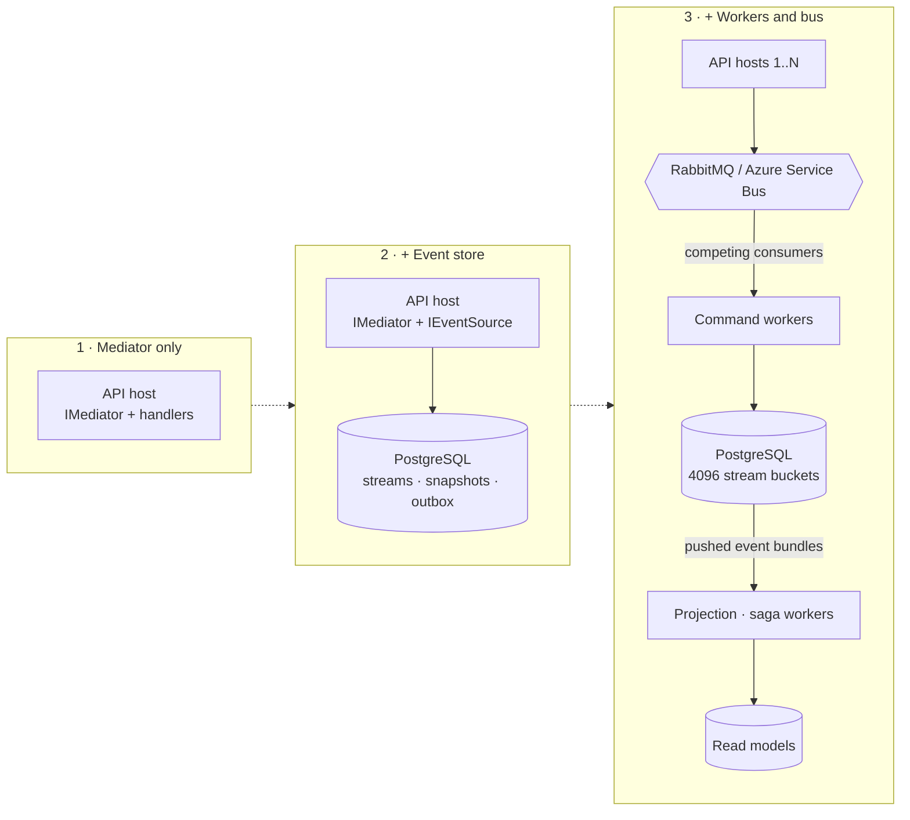

<div align="center">


# Stratara

**CQRS and Event Sourcing for .NET 10. Start with a mediator, grow into the full stack, keep the receipts.**

[](https://github.com/yesbert/Stratara/actions/workflows/ci.yml) [](https://www.nuget.org/packages?q=Stratara) [](LICENSE) [](https://docs.stratara.tech) [](https://dotnet.microsoft.com/)

</div>

---

Stratara is one MIT-licensed family of 25 NuGet packages, versioned together: mediator, event store on PostgreSQL, outbox over RabbitMQ or Azure Service Bus, projections, sagas, identity — and, as defaults rather than add-ons, hash-chained tamper-evident event streams and tenant-bound field encryption with GDPR-grade crypto-shredding. Take one package or take all of them; they never disagree about each other's version.

## Pick your door

### 🚪 I need a mediator

Commands, queries and pipeline behaviors, in process. One package; no database, no broker, no telemetry setup.

```bash
dotnet add package Stratara.Mediator
```

```csharp
public sealed record OpenAccount(string Owner, decimal Initial) : ICommand<Guid>;

public sealed class OpenAccountHandler : IQueryHandler<OpenAccount, Guid>
{
    public Task<Guid> HandleAsync(OpenAccount cmd, CancellationToken ct)
        => Task.FromResult(Guid.NewGuid());
}

// Program.cs
builder.Services
    .AddMediator()
    .AddQueryHandlersFromAssemblyContaining<Program>();

using var scope = app.Services.CreateScope();          // IMediator is scoped
var id = await scope.ServiceProvider.GetRequiredService<IMediator>()
    .HandleAsync(new OpenAccount("Alice", 100m));
```

→ [First Stratara app](https://docs.stratara.tech/getting-started/first-stratara-app.html) · [`samples/Stratara.Sample.CqrsBasics`](samples/Stratara.Sample.CqrsBasics)

### 🚪 I want event sourcing without the plumbing

Aggregates and events on PostgreSQL, snapshots, optimistic concurrency, an outbox, push-driven projections and replay. You write the aggregate; the store, the outbox and the workers ship.

```bash
dotnet add package Stratara.EventSourcing.WorkerDefaults
```

```csharp
public sealed record InvoiceIssued(Guid InvoiceId, Guid TenantId, decimal Total) : IAggregateCreationEvent;

public sealed class Invoice : ITenantAggregate
{
    public Guid Id { get; set; }
    public Guid TenantId { get; set; }
    public decimal Total { get; set; }

    public void Apply(InvoiceIssued e) => (Id, TenantId, Total) = (e.InvoiceId, e.TenantId, e.Total);
}

// inside a command handler
await events.CreateAsync<Invoice>(id, new InvoiceIssued(id, tenantId, 120m), ct);
await events.SaveChangesAsync(ct);   // one transaction, snapshot by policy, one bundle to the outbox
```

→ [Write a command handler](https://docs.stratara.tech/guides/write-a-command-handler.html) · [Write a projection](https://docs.stratara.tech/guides/write-a-projection.html) · [Event-sourced walkthrough](https://docs.stratara.tech/samples/02-event-sourced.html)

### 🚪 I run a multi-tenant SaaS and get audited

Every event stream is hash-chained and anchored outside your database. `[EncryptData]` fields are sealed with the tenant as associated data, so a row leaked from one tenant cannot be read in another, even with the master key. Erasure is a key you destroy, not history you rewrite.

```csharp
public sealed record CustomerRegistered(
    Guid CustomerId,
    Guid TenantId,
    [property: EncryptData] string Email) : IAggregateCreationEvent;

// GDPR Art. 17: shred the subject's key — events, snapshots, replicas and backups become noise
await keyStore.EraseScopeAsync(scope, ct);
```

→ [Tamper-evident streams](https://docs.stratara.tech/concepts/tamper-evident-streams.html) · [Tenant-aware encryption](https://docs.stratara.tech/concepts/tenant-aware-encryption.html) · hero samples [`TamperProof`](samples/Stratara.Sample.TamperProof) and [`Encryption`](samples/Stratara.Sample.Encryption)

## It grows with you

The handler from door one runs unchanged behind door three. Only the hosting around it changes.



## Why Stratara

- **Integrated, not assembled.** Mediator, outbox, event store, sagas, projections and identity are one family at one version. No composition tax, no version-skew puzzles.
- **Audit-grade by default.** Hash-chained streams with external anchors; a direct edit in the database no longer recomputes, and a verification pass names the sequence where it broke.
- **Tenant isolation you can prove.** Cryptographic binding of encrypted fields to their tenant, plus a mediator-entrance guard that rejects a request naming another tenant before your handler runs.
- **Erasure without rewriting history.** Per-subject keys; `EraseScopeAsync` makes every copy undecryptable, including the backups you cannot reach.
- **Fast and horizontal.** Reflection-free hot paths, push-driven projections, deterministic stream buckets so workers scale out as competing consumers.

## Numbers, not adjectives

Measured with [BenchmarkDotNet](https://github.com/dotnet/BenchmarkDotNet) on a fanless MacBook Air M4 (.NET 10, Arm64). Conservative ratios, not a tuned server's ceiling. Re-run: `dotnet run -c Release --project tests/Stratara.Benchmarks -- --filter '*'`.

| What | Result |
|---|---:|
| Replay 1,000,000 events in memory | **11.6 ms**, **64 B** allocated |
| Replay 10,000 events | 0.11 ms, 64 B |
| Property write, compiled delegate vs reflection | 0.47 ns vs 6.04 ns, **~13× faster**, allocation-free |
| Tamper-evident chain hashing | sub-microsecond per event |

Methodology and caveats: [Performance & scaling](https://docs.stratara.tech/concepts/performance-and-scaling.html).

## Documentation

**[docs.stratara.tech](https://docs.stratara.tech)** — concepts, getting started, guides, sample walkthroughs, the [package map](https://docs.stratara.tech/overview/packages.html) and the generated API reference. Every guarantee is written down as a specification under [`openspec/specs/`](openspec/specs/) and tested in CI; the docs are derived from those specs.

**Using an AI assistant?** Point it at [`llms.txt`](llms.txt) (orientation) and [`llms-full.txt`](llms-full.txt) (every registration, option and exception, generated from the assemblies), or connect any MCP-capable client to `gitmcp.io/yesbert/Stratara`.

## Samples

Self-contained concept samples, each running in under a second: a five-step learning path on one bank-account domain (`CqrsBasics` → `EventSourced` → `OutboxWorker` → `MoneyTransferSaga` → `AspNetCoreApi`), two hero samples (`TamperProof`, `Encryption`), plus `Validation`, `Identity` and `IdentityDirectory`. See [`samples/`](samples/) and the [walkthroughs](https://docs.stratara.tech/samples/).

```bash
dotnet run --project samples/Stratara.Sample.TamperProof
```

## Build from source

Requires the .NET 10 SDK (`global.json` pins it).

```bash
dotnet build Stratara.Publish.slnf -c Release
./scripts/local-gauntlet.sh          # what CI runs
```

## Versioning and license

Lockstep across the family — one `<VersionPrefix>` in `Directory.Build.props`. A `v*` tag publishes to nuget.org and nothing else does; prereleases are tagged `v4.0.0-preview.1` and reach only those who ask. Per-release notes: [`CHANGELOG.md`](CHANGELOG.md).

**MIT** — see [`LICENSE`](LICENSE). Free for any use, including commercial; no competition clause, no time delay.

## Contributing

Issues, questions and pull requests are welcome: [open an issue](https://github.com/yesbert/Stratara/issues/new/choose), read [`CONTRIBUTING.md`](CONTRIBUTING.md), run `./scripts/local-gauntlet.sh` before a PR. Security issues go through [`SECURITY.md`](SECURITY.md), not a public issue. Community standards: [`CODE_OF_CONDUCT.md`](CODE_OF_CONDUCT.md); getting help: [`SUPPORT.md`](SUPPORT.md).

The repository was mirrored from a private one until 2026-08-30, one squashed commit per release; development happens here now.
