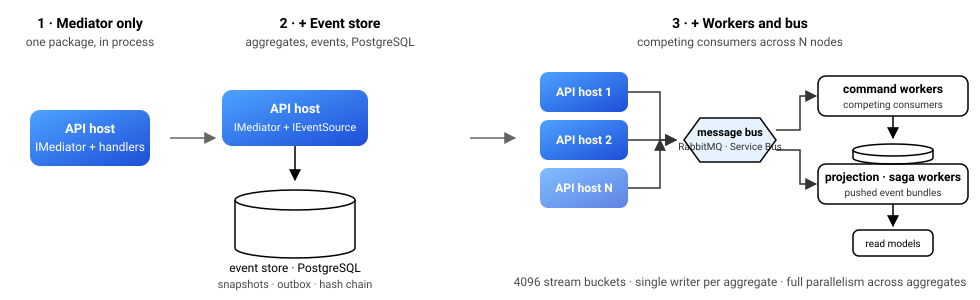

<section class="st-hero">
  
  <h1>CQRS and Event Sourcing for .NET. <em>Start small, keep the receipts.</em></h1>
  <p class="st-lead">
    Begin with a lean mediator. Add an event store when you need one. Scale out with an outbox,
    projections and sagas when you must. One MIT-licensed family of packages, one version, and
    tamper-evident streams and tenant-bound encryption already inside.
  </p>
  <div class="st-cta">
    <a class="btn btn-primary" href="getting-started/first-stratara-app.md">Get started in 5 minutes</a>
    <a class="btn btn-outline-secondary" href="https://github.com/yesbert/Stratara"><i class="bi bi-github"></i>&nbsp;GitHub</a>
  </div>
  <div class="st-badges">
    <a href="https://www.nuget.org/packages?q=Stratara"></a>
    <a href="https://github.com/yesbert/Stratara/actions/workflows/ci.yml"></a>
    <a href="https://github.com/yesbert/Stratara/blob/main/LICENSE"></a>
    <a href="https://dotnet.microsoft.com/"></a>
  </div>
</section>

<section class="st-section st-basics">
  <p class="st-basics-lead">New to the terms? Thirty seconds, then pick a door.</p>
  <div class="row g-4">
    <div class="col-md-4"><div class="st-basic">
      <h3>Mediator</h3>
      <p>A controller that knows ten services is hard to test and harder to change. With a mediator it hands over one object &mdash; <code>OpenAccount</code> &mdash; and a dispatcher finds the single handler that answers it. One request, one handler, and no web server needed to test it.</p>
    </div></div>
    <div class="col-md-4"><div class="st-basic">
      <h3>CQRS</h3>
      <p><strong>Command Query Responsibility Segregation.</strong> A command changes something and returns little; a query reads and changes nothing. Keeping them apart lets each side take the shape and the scaling its own job needs. It is a routing decision first, not a second database.</p>
    </div></div>
    <div class="col-md-4"><div class="st-basic">
      <h3>Event sourcing</h3>
      <p>Store the facts that happened &mdash; <code>AccountOpened</code>, <code>MoneyDeposited</code> &mdash; instead of the state they produced. Current state is a fold over those facts, so the history <em>is</em> the source of truth rather than an audit log kept beside it.</p>
    </div></div>
  </div>
  <p class="st-sub" style="margin-top:1.5rem"><a href="overview/glossary.md">Full glossary &rarr;</a> &nbsp;&middot;&nbsp; <a href="concepts/why-event-sourcing.md">Why event sourcing &rarr;</a></p>
</section>

<section class="st-section">
  <h2>Pick your door</h2>
  <p class="st-sub">Three reasons people arrive here. Each one is a real entry point, not a teaser for the whole stack.</p>
  <div class="row g-4">

<div class="col-md-4">
<div class="st-door">
<div class="st-icon"><i class="bi bi-lightning-charge"></i></div>
<h3>I need a mediator</h3>
<p class="st-who">Commands, queries and pipeline behaviors, in process, MIT. Nothing else comes along.</p>

```bash
dotnet add package Stratara.Mediator
```

<!-- stratara-snippet-ignore: landing-page excerpt mixing a type declaration with host statements; the compilable form is docs/getting-started/first-stratara-app.md -->
```csharp
public sealed record OpenAccount(string Owner)
    : ICommand<Guid>;

public sealed class OpenAccountHandler
    : IQueryHandler<OpenAccount, Guid>
{
    public Task<Guid> HandleAsync(
        OpenAccount cmd, CancellationToken ct)
        => Task.FromResult(Guid.NewGuid());
}

builder.Services
    .AddMediator()
    .AddQueryHandlersFromAssemblyContaining<Program>();
```

<p class="st-not"><strong>You do not need:</strong> a database, a broker, or any telemetry setup.</p>
<a class="st-go" href="getting-started/first-stratara-app.md">First Stratara app →</a>
</div>
</div>

<div class="col-md-4">
<div class="st-door">
<div class="st-icon"><i class="bi bi-layers"></i></div>
<h3>I want event sourcing without the plumbing</h3>
<p class="st-who">Aggregates and events on PostgreSQL, snapshots, outbox, projections, replay — shipped, not sketched.</p>

```bash
dotnet add package Stratara.EventSourcing.WorkerDefaults
```

<!-- stratara-snippet-ignore: landing-page excerpt; the handler body around the two awaits is shown in docs/guides/write-a-command-handler.md -->
```csharp
public sealed record InvoiceIssued(
    Guid InvoiceId, Guid TenantId, decimal Total)
    : IAggregateCreationEvent;

public sealed class Invoice : ITenantAggregate
{
    public Guid Id { get; set; }
    public Guid TenantId { get; set; }
    public decimal Total { get; set; }

    public void Apply(InvoiceIssued e) =>
        (Id, TenantId, Total) =
        (e.InvoiceId, e.TenantId, e.Total);
}

// inside a command handler
await events.CreateAsync<Invoice>(
    id, new InvoiceIssued(id, tenantId, 120m), ct);
await events.SaveChangesAsync(ct);
```

<p class="st-not"><strong>You do not need:</strong> to write an event store, an outbox or a replay. They are the product.</p>
<a class="st-go" href="samples/02-event-sourced.md">Event-sourced walkthrough →</a>
</div>
</div>

<div class="col-md-4">
<div class="st-door">
<div class="st-icon"><i class="bi bi-shield-lock"></i></div>
<h3>I run a multi-tenant SaaS and get audited</h3>
<p class="st-who">Hash-chained streams, fields sealed to their tenant, and GDPR erasure by destroying a key.</p>

```bash
dotnet add package Stratara.Security
```

<!-- stratara-snippet-ignore: landing-page excerpt; the full flow is docs/concepts/tenant-aware-encryption.md and samples/Stratara.Sample.Encryption -->
```csharp
public sealed record CustomerRegistered(
    Guid CustomerId,
    Guid TenantId,
    [property: EncryptData] string Email)
    : IAggregateCreationEvent;

// Right to erasure: shred the subject's key.
// Events, snapshots, replicas and backups
// all become noise.
await keyStore.EraseScopeAsync(scope, ct);
```

<p class="st-not"><strong>You do not need:</strong> a separate audit product, or a <code>WHERE tenant_id</code> you hope nobody forgets.</p>
<a class="st-go" href="concepts/tamper-evident-streams.md">Tamper-evident streams →</a>
</div>
</div>

  </div>
</section>

<section class="st-section">
  <h2>It grows with you</h2>
  <p class="st-sub">The same handler you wrote on day one runs unchanged on day three hundred. Only the hosting around it changes.</p>
  <figure class="st-grow">
    
    <figcaption>Stage 1 is one package. Stage 2 adds PostgreSQL. Stage 3 adds a broker and scales out as competing consumers.</figcaption>
  </figure>
</section>

<section class="st-section">
  <h2>What is in the box</h2>
  <p class="st-sub">Integrated, not assembled. Every part below is versioned together and tested against the others.</p>
  <div class="row g-4">
    <div class="col-md-6 col-lg-3"><div class="st-feature"><h4>Mediator and pipeline</h4><p>Commands, queries, open-generic behaviors in registration order, authorization and tenant isolation at the entrance.</p></div></div>
    <div class="col-md-6 col-lg-3"><div class="st-feature"><h4>Event store on PostgreSQL</h4><p>Streams, snapshots, optimistic concurrency, event upcasting, command audit — through EF Core you already run.</p></div></div>
    <div class="col-md-6 col-lg-3"><div class="st-feature"><h4>Outbox and messaging</h4><p>At-least-once dispatch over RabbitMQ or Azure Service Bus, publisher confirms, a heavy-command lane.</p></div></div>
    <div class="col-md-6 col-lg-3"><div class="st-feature"><h4>Projections and sagas</h4><p>Push-driven from the event bus, per-aggregate ordering, retry for facts that arrive before their beginning.</p></div></div>
    <div class="col-md-6 col-lg-3"><div class="st-feature"><h4>Tamper-evident streams</h4><p>Every event hash-chained, anchors pinned outside your database. Edit a row and the chain names the sequence.</p></div></div>
    <div class="col-md-6 col-lg-3"><div class="st-feature"><h4>Tenant-bound encryption</h4><p>AES-GCM with the tenant as associated data; a row leaked from one tenant cannot be read in another.</p></div></div>
    <div class="col-md-6 col-lg-3"><div class="st-feature"><h4>Identity and membership</h4><p>Users in many tenants with per-membership roles, a code-first permission catalog, API keys that share the same plane.</p></div></div>
    <div class="col-md-6 col-lg-3"><div class="st-feature"><h4>Observability defaults</h4><p>One activity source, one meter, stable log-event ids, OpenTelemetry and Serilog wired in a line.</p></div></div>
  </div>
</section>

<section class="st-section">
  <h2>Numbers, not adjectives</h2>
  <p class="st-sub">Measured with BenchmarkDotNet on a fanless MacBook Air M4. Read them as conservative ratios, not a tuned server's ceiling.</p>
  <div class="st-numbers">
    <div class="st-number"><div class="st-big">11.6 ms</div><div class="st-what">to replay one million events in memory</div></div>
    <div class="st-number"><div class="st-big">64 B</div><div class="st-what">allocated for that replay, regardless of length</div></div>
    <div class="st-number"><div class="st-big">13×</div><div class="st-what">faster property writes than reflection, allocation-free</div></div>
    <div class="st-number"><div class="st-big">&lt; 1 µs</div><div class="st-what">per event for tamper-evident chain hashing</div></div>
  </div>
  <p class="st-sub" style="margin-top:1.25rem"><a href="concepts/performance-and-scaling.md">Methodology and caveats →</a></p>
</section>

<section class="st-section st-compare">
  <h2>Where it sits</h2>
  <p class="st-sub">An honest map. Each project below is good at what it does; this is about scope and license, not ranking.</p>
  <div class="table-responsive">
  <table class="table">
    <thead><tr><th>Project</th><th>Scope</th><th>License</th><th>Approach</th></tr></thead>
    <tbody>
      <tr><td>Stratara</td><td>Mediator, event store, outbox, projections, sagas, identity, encryption</td><td>MIT</td><td>One lockstep family; opt in per package; audit properties are defaults, not add-ons</td></tr>
      <tr><td>MediatR</td><td>In-process mediator</td><td>RPL-1.5 or commercial from v13; free Community edition below 5 M USD revenue</td><td>The reference mediator; bring your own everything else</td></tr>
      <tr><td>Marten + Wolverine</td><td>Document DB and event store on PostgreSQL; messaging and handlers</td><td>MIT, open core with commercial support</td><td>Two libraries that compose well; broad and mature</td></tr>
      <tr><td>MassTransit</td><td>Distributed messaging, sagas</td><td>v9 commercial since 2026; v8 Apache 2.0, supported to end of 2026</td><td>Transport-centric; no event store</td></tr>
      <tr><td>KurrentDB (EventStoreDB)</td><td>Purpose-built event database</td><td>Vendor license</td><td>A server you operate, not a library you reference</td></tr>
    </tbody>
  </table>
  </div>
  <p class="st-note">License facts verified September 2026 against each project's published terms. Check the source before you decide.</p>
</section>

<section class="st-final">
  <h2>Five minutes to a running mediator. An afternoon to event sourcing.</h2>
  <p class="st-lead">Every guarantee on this page is written down as a specification and tested in CI. Read them, run the samples, then decide.</p>
  <div class="st-cta">
    <a class="btn btn-primary" href="getting-started/first-stratara-app.md">Get started</a>
    <a class="btn btn-outline-secondary" href="samples/index.md">Run the samples</a>
    <a class="btn btn-outline-secondary" href="overview/packages.md">See all 25 packages</a>
  </div>
</section>

> **Derived.** The behaviour described on this page is specified under `openspec/specs/` in the repository. Those specifications are the source; this page explains and illustrates them.
